# Mastra Agents

Mastra is a framework for building AI agents. It provides a set of pre-defined agents that can be used for various tasks. Each agent is designed to handle a specific type of request and can be customized to fit your needs.

## Available Agents

1. **Worker Agent**: Handles file management and data retrieval tasks.
2. **Weather Agent**: Provides weather information for specific locations.
3. **Stock Agent**: Fetches stock information for specific companies.
4. **MCP Agent**: Interacts with the Model Context Protocol (MCP) for advanced tasks.
5. **Supervisor Agent**: Manages user interactions and delegates tasks to other agents.

## Usage

To use an agent, simply import it and call its `handle` method with the user's request. The agent will process the request and return a response.

```typescript
import { weatherAgent } from './agents/weather-agent';

const response = await weatherAgent.handle({
  location: 'New York, NY'
});
```

```mermaid
graph TD

    501["User<br>External Actor"]
    526["Inngest Functions<br>Inngest/TypeScript"]
    527["User<br>External Actor"]
    subgraph 498["Inngest Background Processing<br>Inngest SDK"]
        513["Inngest Functions Entry<br>Inngest SDK"]
        514["Weather Workflow Logic<br>TypeScript, Inngest"]
        %% Edges at this level (grouped by source)
        513["Inngest Functions Entry<br>Inngest SDK"] -->|Executes| 514["Weather Workflow Logic<br>TypeScript, Inngest"]
    end
    subgraph 499["AI Mastra Application<br>Node.js/TypeScript"]
        507["Mastra Core Logic<br>TypeScript Module"]
        508["AI Agents<br>TypeScript"]
        509["Agent Memory &amp; Vector Store<br>LibSQL, Fastembed, TS"]
        510["Tooling Services<br>TypeScript"]
        511["Observability Module<br>PinoLogger, TypeScript"]
        512["Evaluation Framework<br>TypeScript"]
        %% Edges at this level (grouped by source)
        508["AI Agents<br>TypeScript"] -->|Uses| 509["Agent Memory &amp; Vector Store<br>LibSQL, Fastembed, TS"]
        508["AI Agents<br>TypeScript"] -->|Utilizes| 510["Tooling Services<br>TypeScript"]
        508["AI Agents<br>TypeScript"] -->|Uses for logging| 511["Observability Module<br>PinoLogger, TypeScript"]
        510["Tooling Services<br>TypeScript"] -->|Queries vector data via| 509["Agent Memory &amp; Vector Store<br>LibSQL, Fastembed, TS"]
        507["Mastra Core Logic<br>TypeScript Module"] -->|Orchestrates| 508["AI Agents<br>TypeScript"]
        507["Mastra Core Logic<br>TypeScript Module"] -->|Configures| 509["Agent Memory &amp; Vector Store<br>LibSQL, Fastembed, TS"]
        507["Mastra Core Logic<br>TypeScript Module"] -->|Uses for logging| 511["Observability Module<br>PinoLogger, TypeScript"]
        509["Agent Memory &amp; Vector Store<br>LibSQL, Fastembed, TS"] -->|Uses for logging| 511["Observability Module<br>PinoLogger, TypeScript"]
    end
    subgraph 500["External Systems"]
        502["LLM APIs<br>Google Gemini, etc."]
        503["MCP Services<br>MCPClient API"]
        504["External Data APIs<br>Weather, Stock, etc."]
        505["Inngest Platform<br>Inngest Cloud/SDK"]
        506["Persistence Services<br>LibSQL, Fastembed"]
    end
    subgraph 515["External Systems"]
        528["Google Cloud<br>Vertex AI, GenAI SDK"]
        529["MCP Services<br>MCPClient"]
        530["Weather Services<br>External API"]
        531["Stock Market Services<br>External API"]
        532["Inngest Platform<br>Inngest"]
        533["Data Persistence<br>LibSQL, FastEmbed"]
    end
    subgraph 516["AI Mastra Application<br>Node.js/TypeScript"]
        517["Mastra System Core<br>TypeScript"]
        518["Master Agent<br>TypeScript"]
        519["Supervisor Agent<br>TypeScript"]
        520["Specialized Agents<br>TypeScript"]
        521["Agent Memory &amp; State<br>TypeScript, LibSQL"]
        522["Tooling Services<br>TypeScript"]
        523["Workflows Module<br>TypeScript"]
        524["Observability Module<br>TypeScript"]
        525["Evaluation Module<br>TypeScript"]
        %% Edges at this level (grouped by source)
        517["Mastra System Core<br>TypeScript"] -->|Initializes/Provides| 518["Master Agent<br>TypeScript"]
        517["Mastra System Core<br>TypeScript"] -->|Initializes/Provides| 521["Agent Memory &amp; State<br>TypeScript, LibSQL"]
        517["Mastra System Core<br>TypeScript"] -->|Integrates| 524["Observability Module<br>TypeScript"]
        517["Mastra System Core<br>TypeScript"] -->|May trigger| 525["Evaluation Module<br>TypeScript"]
        518["Master Agent<br>TypeScript"] -->|Orchestrates| 519["Supervisor Agent<br>TypeScript"]
        518["Master Agent<br>TypeScript"] -->|Delegates to| 520["Specialized Agents<br>TypeScript"]
        518["Master Agent<br>TypeScript"] -->|Uses| 521["Agent Memory &amp; State<br>TypeScript, LibSQL"]
        518["Master Agent<br>TypeScript"] -->|Uses| 522["Tooling Services<br>TypeScript"]
        518["Master Agent<br>TypeScript"] -->|Triggers| 523["Workflows Module<br>TypeScript"]
        518["Master Agent<br>TypeScript"] -->|Uses| 524["Observability Module<br>TypeScript"]
        519["Supervisor Agent<br>TypeScript"] -->|Manages| 520["Specialized Agents<br>TypeScript"]
        519["Supervisor Agent<br>TypeScript"] -->|Uses| 521["Agent Memory &amp; State<br>TypeScript, LibSQL"]
        519["Supervisor Agent<br>TypeScript"] -->|Uses| 522["Tooling Services<br>TypeScript"]
        519["Supervisor Agent<br>TypeScript"] -->|Uses| 524["Observability Module<br>TypeScript"]
        520["Specialized Agents<br>TypeScript"] -->|Use| 521["Agent Memory &amp; State<br>TypeScript, LibSQL"]
        520["Specialized Agents<br>TypeScript"] -->|Use| 522["Tooling Services<br>TypeScript"]
        520["Specialized Agents<br>TypeScript"] -->|Use| 524["Observability Module<br>TypeScript"]
        523["Workflows Module<br>TypeScript"] -->|Uses| 522["Tooling Services<br>TypeScript"]
        521["Agent Memory &amp; State<br>TypeScript, LibSQL"] -->|Uses| 524["Observability Module<br>TypeScript"]
    end
    %% Edges at this level (grouped by source)
    508["AI Agents<br>TypeScript"] -->|Calls| 502["LLM APIs<br>Google Gemini, etc."]
    510["Tooling Services<br>TypeScript"] -->|Calls for embedding/search| 502["LLM APIs<br>Google Gemini, etc."]
    510["Tooling Services<br>TypeScript"] -->|Accesses| 503["MCP Services<br>MCPClient API"]
    510["Tooling Services<br>TypeScript"] -->|Fetches data from| 504["External Data APIs<br>Weather, Stock, etc."]
    512["Evaluation Framework<br>TypeScript"] -->|Uses| 502["LLM APIs<br>Google Gemini, etc."]
    514["Weather Workflow Logic<br>TypeScript, Inngest"] -->|Calls| 502["LLM APIs<br>Google Gemini, etc."]
    514["Weather Workflow Logic<br>TypeScript, Inngest"] -->|Uses| 508["AI Agents<br>TypeScript"]
    514["Weather Workflow Logic<br>TypeScript, Inngest"] -->|May use| 510["Tooling Services<br>TypeScript"]
    507["Mastra Core Logic<br>TypeScript Module"] -->|Triggers jobs via| 505["Inngest Platform<br>Inngest Cloud/SDK"]
    509["Agent Memory &amp; Vector Store<br>LibSQL, Fastembed, TS"] -->|Stores/Retrieves data| 506["Persistence Services<br>LibSQL, Fastembed"]
    501["User<br>External Actor"] -->|Initiates tasks| 507["Mastra Core Logic<br>TypeScript Module"]
    501["User<br>External Actor"] -->|Runs evaluations| 512["Evaluation Framework<br>TypeScript"]
    505["Inngest Platform<br>Inngest Cloud/SDK"] -->|Invokes| 513["Inngest Functions Entry<br>Inngest SDK"]
    527["User<br>External Actor"] -->|Initiates tasks via| 518["Master Agent<br>TypeScript"]
    518["Master Agent<br>TypeScript"] -->|Schedules jobs via| 526["Inngest Functions<br>Inngest/TypeScript"]
    519["Supervisor Agent<br>TypeScript"] -->|Schedules jobs via| 526["Inngest Functions<br>Inngest/TypeScript"]
    520["Specialized Agents<br>TypeScript"] -->|Call LLMs/APIs via| 528["Google Cloud<br>Vertex AI, GenAI SDK"]
    526["Inngest Functions<br>Inngest/TypeScript"] -->|May use| 521["Agent Memory &amp; State<br>TypeScript, LibSQL"]
    526["Inngest Functions<br>Inngest/TypeScript"] -->|May use| 522["Tooling Services<br>TypeScript"]
    526["Inngest Functions<br>Inngest/TypeScript"] -->|May use| 524["Observability Module<br>TypeScript"]
    526["Inngest Functions<br>Inngest/TypeScript"] -->|Runs on / Managed by| 532["Inngest Platform<br>Inngest"]
    523["Workflows Module<br>TypeScript"] -->|Uses LLM from| 528["Google Cloud<br>Vertex AI, GenAI SDK"]
    521["Agent Memory &amp; State<br>TypeScript, LibSQL"] -->|Uses for embeddings/models| 528["Google Cloud<br>Vertex AI, GenAI SDK"]
    521["Agent Memory &amp; State<br>TypeScript, LibSQL"] -->|Stores/Retrieves data with| 533["Data Persistence<br>LibSQL, FastEmbed"]
    522["Tooling Services<br>TypeScript"] -->|Accesses| 528["Google Cloud<br>Vertex AI, GenAI SDK"]
    522["Tooling Services<br>TypeScript"] -->|Accesses| 529["MCP Services<br>MCPClient"]
    522["Tooling Services<br>TypeScript"] -->|Accesses| 530["Weather Services<br>External API"]
    522["Tooling Services<br>TypeScript"] -->|Accesses| 531["Stock Market Services<br>External API"]
    525["Evaluation Module<br>TypeScript"] -->|Uses models/services from| 528["Google Cloud<br>Vertex AI, GenAI SDK"]
```

