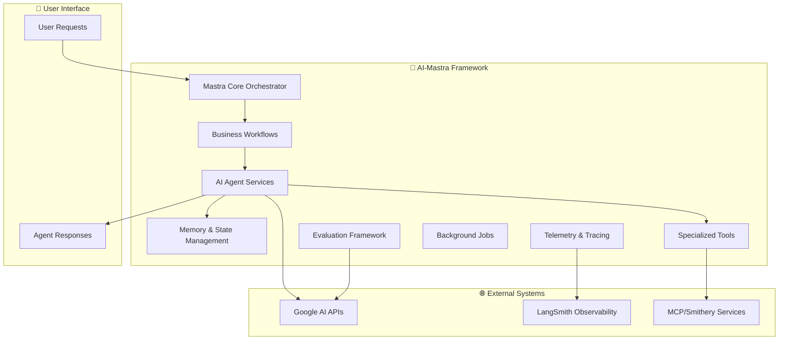

# 🤖 AI-Mastra

Enterprise-Grade AI Agent Framework

Building intelligent, autonomous agents with advanced memory, observability, and multi-modal capabilities


[](https://opensource.org/licenses/MIT)
[](https://nodejs.org/)
[](https://github.com/your-username/ai-mastra)
[](https://github.com/your-username/ai-mastra/blob/main/CONTRIBUTING.md)

---

## 📋 Table of Contents

- [🎯 Overview](#-overview)
- [✨ Key Features](#-key-features)
- [🏗️ System Architecture](#️-system-architecture)
- [🚀 Quick Start](#-quick-start)
- [🤖 Available Agents](#-available-agents)
- [🛠️ Available Tools](#️-available-tools)
- [🔄 Production Workflows](#-production-workflows)
- [🔧 Configuration](#-configuration)
- [📊 Monitoring & Observability](#-monitoring--observability)
- [💾 Memory & Persistence](#-memory--persistence)
- [🧪 Evaluation Framework](#-evaluation-framework)
- [🛠️ Development](#️-development)
- [📚 Documentation](#-documentation)
- [🤝 Contributing](#-contributing)
- [📄 License](#-license)

## 🎯 Overview

AI-Mastra is a production-ready, enterprise-grade framework for building and deploying intelligent AI agents. Built on top of the Mastra ecosystem, it provides a comprehensive solution for creating autonomous agents with advanced capabilities including persistent memory, real-time observability, multi-modal interactions, and seamless integration with modern AI models.

### What Makes AI-Mastra Different?

- **🧠 Advanced Memory System**: Persistent, semantic memory with intelligent summarization
- **📈 Enterprise Observability**: Full LangSmith integration with token tracking and performance metrics
- **🔄 Multi-Agent Orchestration**: Sophisticated agent coordination and task delegation
- **🌐 MCP Integration**: Native Model Context Protocol support for extensible tooling
- **⚡ Production-Ready**: Built-in evaluation framework, error handling, and deployment tools

## ✨ Key Features

### 🤖 Intelligent Agent System

- Pre-built specialized agents (Weather, Stock, MCP, RAG, Supervisor)
- Custom agent creation with role-based instructions
- Multi-agent workflows and collaboration
- Advanced tool integration and execution

### 🧠 Persistent Memory & Context

- Semantic memory with vector embeddings
- Intelligent context summarization
- Thread-based conversation management
- Token-aware memory optimization

### 📊 Enterprise Observability

- Real-time LangSmith tracing and monitoring
- Performance metrics and token usage tracking
- Error tracking and debugging tools
- Custom evaluation metrics

### 🔧 Developer Experience

- Type-safe TypeScript implementation
- Hot reload development environment
- Comprehensive evaluation framework
- Extensive logging and debugging support

## 🏗️ System Architecture

AI-Mastra follows a modular, enterprise-grade architecture designed for scalability and maintainability:



## 🚀 Quick Start

### Prerequisites

- **Node.js** 20.9.0 or higher
- **pnpm** (recommended) or npm
- **Environment Variables** (see [Configuration](#-configuration))

### Installation

```bash
# Clone the repository
git clone https://github.com/your-username/ai-mastra.git
cd ai-mastra

# Install dependencies
pnpm install

# Set up environment variables
cp .env.example .env
# Edit .env with your API keys and configuration
```

### Environment Setup

Create a `.env` file with the following required variables:

```env
# Google AI Configuration
GOOGLE_AI_API_KEY=your_google_ai_api_key

# LangSmith Observability
LANGSMITH_API_KEY=your_langsmith_api_key
LANGSMITH_PROJECT=your_project_name
LANGSMITH_TRACING=true

# Database Configuration
DATABASE_URL=your_database_url
DATABASE_AUTH_TOKEN=your_auth_token

# MCP Configuration
SMITHERY_API=your_smithery_api_key
```

### Basic Usage

```typescript
import { masterAgent } from './src/mastra/agents/masterAgent';

// Initialize and use an agent
const response = await masterAgent.generate([
  { role: 'user', content: 'Analyze the current weather patterns' }
]);

console.log(response.text);
```

### Development Commands

```bash
# Start development server with hot reload
pnpm dev

# Build for production
pnpm build

# Run evaluation tests
pnpm eval
```

## 🤖 Available Agents

AI-Mastra includes 7 specialized agents, each designed for specific tasks and domains:

### 🎯 Master Agent

The central orchestrator designed to manage and interact with the Model Context Protocol (MCP). Primary interface for complex task management, file operations, and system optimization.

```typescript
import { masterAgent } from './src/mastra/agents/masterAgent';

const result = await masterAgent.run('Coordinate a comprehensive data retrieval task');
```

### 🔌 MCP Agent

Specialized in Model Context Protocol interactions with advanced MCP command execution and data management capabilities.

```typescript
import { mcpAgent } from './src/mastra/agents/mcpAgent';

const mcpResult = await mcpAgent.run('Execute MCP command for file system operations');
```

### 🧠 RAG Agent

*Currently in development* - Advanced Retrieval-Augmented Generation capabilities for knowledge-based responses.

```typescript
import { ragAgent } from './src/mastra/agents/ragAgent';
// RAG Agent implementation coming soon
```

### 📈 Stock Market Agent

Financial market analysis with real-time stock data from integrated APIs. Provides stock prices, market caps, and financial metrics.

```typescript
import { stockAgent } from './src/mastra/agents/stockAgent';

const stockData = await stockAgent.run('Get current stock price for Apple');
```

### 👥 Supervisor Agent

Task coordination and MCP interaction supervisor with focus on user guidance and proper system operation.

```typescript
import { supervisorAgent } from './src/mastra/agents/supervisorAgent';

const guidance = await supervisorAgent.run('Help me with file management using MCP');
```

### 🌤️ Weather Agent

Real-time weather data and meteorological analysis using Open-Meteo API with geocoding support.

```typescript
import { weatherAgent } from './src/mastra/agents/weather-agent';

const weather = await weatherAgent.run('Current weather in San Francisco');
```

### 💼 Worker Agent

Task execution specialist for automated workflow processing and multi-step operations.

```typescript
import { workerAgent } from './src/mastra/agents/workerAgent';

const task = await workerAgent.run('Execute complex workflow steps');
```

- Real-time weather data retrieval via Open-Meteo API
- Location geocoding and weather condition analysis
- Activity recommendations based on weather patterns
- Weather-based planning and scheduling

**Tools Integrated:**

- Custom weather tool with geocoding
- Vector query for location-based context
- Comprehensive weather condition mapping

```typescript
import { weatherAgent } from './src/mastra/agents/weather-agent';

const weather = await weatherAgent.generate([
  { role: 'user', content: 'What are the current conditions in San Francisco?' }
]);
```

### 📈 Stock Agent

Financial data analysis and market insights specialist.

**Capabilities:**

- Real-time stock price data retrieval
- Market analysis and financial insights
- Company performance tracking
- Investment research and recommendations

**Tools Integrated:**

- Stock price tool via external API
- Vector query for financial context
- Thread-based conversation tracking

```typescript
import { stockAgent } from './src/mastra/agents/stockAgent';

const analysis = await stockAgent.generate([
  { role: 'user', content: 'Analyze AAPL stock performance and market trends' }
]);
```

### 🔍 RAG Agent (Available in Workflows)

Retrieval-Augmented Generation capabilities integrated throughout the system via the RAG Knowledge Workflow for intelligent document processing and querying.

## 🛠️ Available Tools

AI-Mastra includes 7 specialized tools designed for different capabilities and integrations:

### 🔧 Base Toolset

Comprehensive utility toolkit with multiple specialized tools for various operations.

```typescript
import { baseToolset } from './src/mastra/tools/baseToolset';
// Collection of utility tools for common operations
```

### 🌤️ Weather Tool

Real-time weather data retrieval using Open-Meteo API with location geocoding support.

```typescript
import { weatherTool } from './src/mastra/tools/weather-tool';

// Get current weather for any location
const weather = await weatherTool.execute({
  context: { location: 'San Francisco' }
});
// Returns: temperature, feelsLike, humidity, windSpeed, conditions, location
```

### 📈 Stock Tools

Financial market data and stock price information from external APIs.

```typescript
import { stockPriceTool } from './src/mastra/tools/stock-tools';

// Get real-time stock prices
const stockData = await stockPriceTool.execute({
  context: { symbol: 'AAPL' }
});
// Returns: symbol, price, currency, timestamp
```

### 🧠 Vector Query Tool

Semantic search and vector similarity operations using Google embeddings.

```typescript
import { vectorQueryTool } from './src/mastra/tools/vectorQueryTool';

// Perform semantic search on stored vectors
const results = await vectorQueryTool.execute({
  context: { query: 'machine learning concepts' }
});
```

### 🔌 MCP Tools

Model Context Protocol integration for external system interactions and dynamic tool loading.

```typescript
import { mcp } from './src/mastra/tools/mcp';

// Dynamic MCP tool access for filesystem, terminal, web search, and sandbox operations
const mcpResult = await mcp.execute({
  context: { operation: 'file_read', path: '/data/document.txt' }
});
```

### 📄 Document Chunker Tool

Intelligent document processing with configurable chunking strategies for RAG applications.

```typescript
import { chunkerTool } from './src/mastra/tools/chunkerTool';

// Process documents for vector storage
const chunks = await chunkerTool.execute({
  context: { 
    text: 'Large document content',
    strategy: 'recursive',
    chunkSize: 512
  }
});
```

### 🕸️ GraphRAG Tool

Knowledge graph construction and querying for advanced retrieval-augmented generation.

```typescript
import { graphRAGTool } from './src/mastra/tools/graphRAG';

// Build and query knowledge graphs
const graphResult = await graphRAGTool.execute({
  context: { 
    query: 'relationships between concepts',
    graphType: 'semantic'
  }
});
```

### 🌐 External Integration Tools

#### **Weather & Location**

- **Weather Tool**: Real-time weather data via Open-Meteo API
  - Geocoding for location resolution
  - Current conditions, temperature, humidity, wind
  - Weather condition mapping (95+ weather codes)

```typescript
import { weatherTool } from './src/mastra/tools/weather-tool';
// Returns: temperature, humidity, windSpeed, conditions, location
```

#### **Financial Data**

- **Stock Price Tool**: Real-time market data
  - Current stock prices via external API
  - Company symbol lookup and validation
  - Thread context integration for conversation tracking

```typescript
import { stockPriceTool } from './src/mastra/tools/stock-tools';
// Returns: symbol, price, currency, timestamp
```

### 🤖 MCP (Model Context Protocol) Tools

Dynamic tool loading from MCP servers providing extensive external capabilities:

#### **Configured MCP Servers**

- **Filesystem Server**: Complete file system operations
  - File reading, writing, directory navigation
  - File metadata and permissions
  - Path resolution and validation

- **WinTerm Server**: Windows terminal integration
  - Command execution with output capture
  - Process management and monitoring
  - Environment variable access

- **DuckDuckGo Server**: Web search capabilities
  - Real-time web search results
  - Query optimization and result filtering
  - Content extraction and summarization

- **JavaScript Sandbox**: Safe code execution
  - Isolated JavaScript runtime environment
  - Code validation and error handling
  - Result serialization and output capture

### 🧠 AI & Memory Tools

#### **Vector Operations**

- **Vector Query Tool**: Semantic search and retrieval
  - Vector similarity search using Google embeddings
  - Context-aware information retrieval
  - Integration with agent memory systems

```typescript
import { vectorQueryTool } from './src/mastra/tools/vectorQueryTool';
// Model: Google gemini-embedding-exp-03-07
```

#### **RAG (Retrieval-Augmented Generation)**

- **Document Chunker Tool**: Intelligent document processing
  - Multiple chunking strategies (recursive, semantic)
  - Configurable chunk size and overlap
  - Metadata preservation and extraction

```typescript
import { createDocumentChunkerTool } from '@mastra/rag';
// Strategies: "recursive", size: 512, overlap: 50
```

- **GraphRAG Tool**: Knowledge graph construction and querying
  - Graph-based document relationships
  - Multi-hop reasoning capabilities
  - Ranked result retrieval with scoring

```typescript
import { graphRAGTool } from './src/mastra/tools/graphRAG';
// Features: graph construction, semantic querying, result ranking
```

### 🔄 Integration Patterns

All tools follow consistent patterns for maximum interoperability:

- **Zod Schema Validation**: Type-safe input/output validation
- **Error Handling**: Comprehensive error catching and reporting  
- **Tracing Integration**: Full observability via LangSmith
- **Memory Integration**: Context-aware execution with agent memory
- **Thread Support**: Conversation context preservation

## 🔄 Production Workflows

AI-Mastra includes 7 production-ready workflows designed for real-world use cases with comprehensive multi-agent orchestration:

### 🎯 Multi-Agent Workflow

**File**: `src/mastra/workflows/multi-agent-workflow.ts`

Task orchestration with hierarchical delegation and human-in-the-loop capabilities.

```typescript
import { multiAgentWorkflow } from './src/mastra/workflows/multi-agent-workflow';

const result = await multiAgentWorkflow.execute({
  userRequest: 'Analyze market trends and create a strategic report'
});
```

### 📊 Research & Analysis Workflow

**File**: `src/mastra/workflows/research-analysis-workflow.ts`

Automated research collection, analysis, and comprehensive reporting.

```typescript
import { researchAnalysisWorkflow } from './src/mastra/workflows/research-analysis-workflow';

const analysis = await researchAnalysisWorkflow.execute({
  topic: 'AI market trends',
  depth: 'comprehensive'
});
```

### ✍️ Content Creation Workflow

**File**: `src/mastra/workflows/content-creation-workflow.ts`

End-to-end content production with editorial oversight and optimization.

```typescript
import { contentCreationWorkflow } from './src/mastra/workflows/content-creation-workflow';

const content = await contentCreationWorkflow.execute({
  type: 'blog_post',
  topic: 'Enterprise AI adoption',
  tone: 'professional'
});
```

### 📈 Data Processing Workflow

**File**: `src/mastra/workflows/data-processing-workflow.ts`

Automated data ingestion, processing, and business intelligence generation.

```typescript
import { dataProcessingWorkflow } from './src/mastra/workflows/data-processing-workflow';

const insights = await dataProcessingWorkflow.execute({
  dataSource: 'sales_data.csv',
  analysisType: 'trend_analysis'
});
```

### 🧠 RAG Knowledge Workflow

**File**: `src/mastra/workflows/rag-knowledge-workflow.ts`

Enterprise knowledge base creation with intelligent document processing and querying.

```typescript
import { ragKnowledgeWorkflow } from './src/mastra/workflows/rag-knowledge-workflow';

const knowledgeBase = await ragKnowledgeWorkflow.execute({
  documents: ['manual.pdf', 'policies.docx'],
  indexType: 'semantic'
});
```

### 🧪 Evaluation Testing Workflow

**File**: `src/mastra/workflows/evaluation-testing-workflow.ts`

Comprehensive AI system testing with automated evaluation metrics and quality assurance.

```typescript
import { evaluationTestingWorkflow } from './src/mastra/workflows/evaluation-testing-workflow';

const testResults = await evaluationTestingWorkflow.execute({
  testSuite: 'agent_performance',
  metrics: ['accuracy', 'relevance', 'safety']
});
```

### 🌤️ Weather Workflow

**File**: `src/mastra/workflows/weather-workflow.ts`

Weather-based planning and analysis with location services and forecasting.

```typescript
import { weatherWorkflow } from './src/mastra/workflows/weather-workflow';

const weatherPlan = await weatherWorkflow.execute({
  location: 'San Francisco',
  planning_horizon: '7_days'
});
```

## 🔧 Configuration

AI-Mastra requires several environment variables for proper operation. Create a `.env` file in your project root:

```env
# Google AI Configuration (Required)
GOOGLE_AI_API_KEY=your_google_ai_api_key

# LangSmith Observability (Required)
LANGSMITH_API_KEY=your_langsmith_api_key
LANGSMITH_PROJECT=your_project_name
LANGSMITH_TRACING=true

# Database Configuration (Required)
DATABASE_URL=file:./memory.db
DATABASE_AUTH_TOKEN=your_auth_token

# MCP Configuration (Optional)
SMITHERY_API=your_smithery_api_key

# Node.js Environment
NODE_ENV=development
```

### Database Setup

AI-Mastra uses LibSQL for persistent storage:

```typescript
// Automatic database initialization
import { agentStorage, agentVector } from './src/mastra/agentMemory';

// Memory database: file:./memory.db
// Vector database: file:./vector.db
```

## 📊 Monitoring & Observability

AI-Mastra provides comprehensive observability through LangSmith integration with full tracing capabilities.

### LangSmith Integration

```typescript
import { createTracedGoogleModel } from './src/mastra/observability';

// All models automatically traced
const model = createTracedGoogleModel('gemini-2.0-flash-exp', {
  name: 'agent-model',
  tags: ['production', 'agent-interaction']
});
```

### Observability Features

- **Real-time Tracing**: Complete agent conversation flows
- **Token Usage Tracking**: Cost monitoring and optimization
- **Performance Metrics**: Response times and success rates
- **Error Tracking**: Comprehensive error logging and debugging
- **Custom Tags**: Categorization and filtering of operations

### Logging

```typescript
import { observabilityLogger } from './src/mastra/observability';

// Structured logging with Pino
observabilityLogger.info('Agent operation started', {
  agentName: 'stockAgent',
  operation: 'stock_price_query'
});
```

## 💾 Memory & Persistence

AI-Mastra implements a sophisticated memory system using LibSQL for persistent storage and vector embeddings for semantic recall.

### Memory Architecture

```typescript
import { agentMemory } from './src/mastra/agentMemory';

// Shared memory across all agents
const memoryConfig = {
  storage: 'LibSQL', // file:./memory.db
  vectorStore: 'LibSQLVector', // file:./vector.db
  embeddings: 'Google gemini-embedding-exp-03-07'
};
```

### Memory Features

- **Thread-based Conversations**: Organized by resource and thread IDs
- **Semantic Search**: Vector similarity search for context retrieval
- **Intelligent Summarization**: Automatic conversation summarization
- **Token Management**: Memory size optimization with token limiting
- **Metadata Support**: Rich context and tagging system

### Memory Usage

```typescript
// Create conversation thread
await agentMemory.createThread({
  resourceId: 'user-123',
  threadId: 'conversation-456',
  title: 'Stock Analysis Discussion'
});

// Search memory semantically
const relevantContext = await agentMemory.searchMessages({
  threadId: 'conversation-456',
  vectorSearchString: 'Apple stock performance',
  topK: 5
});
```

## 🧪 Evaluation Framework

AI-Mastra includes a comprehensive evaluation system powered by Google Gemini models for assessing AI model performance and output quality.

### Available Metrics

**LLM-Based Evaluation Metrics:**

- **Toxicity Metric**: Content safety and appropriateness evaluation
- **Prompt Alignment Metric**: Response relevance to user instructions  
- **Contextual Recall Metric**: Information retrieval accuracy assessment
- **Context Relevancy Metric**: Context appropriateness evaluation
- **Context Precision Metric**: Information precision and accuracy

**Custom Metrics:**

- **Word Inclusion Metric**: Specific keyword presence verification
- **Model Info Metric**: Model attribution and metadata tracking

### Usage Example

```typescript
import { 
  toxicityMetric, 
  promptAlignmentMetric,
  contextualRecallMetric,
  contextRelevancyMetric,
  contextPrecisionMetric
} from './src/mastra/evals';

// Evaluate content toxicity
const toxicityResult = await toxicityMetric.evaluate({
  input: "User query content",
  output: "Agent response content"
});

// Evaluate prompt alignment
const alignmentResult = await promptAlignmentMetric.evaluate({
  input: "User instruction",
  output: "Agent response"
});

// Evaluate contextual recall with context
const recallResult = await contextualRecallMetric.evaluate({
  input: "Query about context",
  output: "Agent response",
  context: ["Relevant context information"]
});
```

### Evaluation Workflow Integration

The evaluation framework is integrated into workflows for continuous quality assessment:

```typescript
import { evaluationTestingWorkflow } from './src/mastra/workflows/evaluation-testing-workflow';

// Run comprehensive evaluation suite
const results = await evaluationTestingWorkflow.execute({
  testSuite: 'agent-performance',
  metrics: ['toxicity', 'alignment', 'recall', 'relevancy', 'precision'],
  baseline: 'production-v1'
});
```

## 🛠️ Development

### Development Prerequisites

### Development Setup

```bash
# Clone and setup
git clone https://github.com/your-username/ai-mastra.git
cd ai-mastra

# Install dependencies
pnpm install

# Setup environment
cp .env.example .env
# Edit .env with your configuration

# Start development mode
pnpm dev
```

### Key Development Commands

```bash
# Development with hot reload
pnpm dev

# Build for production
pnpm build

# Run evaluation tests
pnpm eval

# Type checking
pnpm type-check

# Linting
pnpm lint
```

### Project Structure

```text
src/mastra/
├── agents/          # Specialized AI agents
├── tools/           # Tool implementations
├── workflows/       # Production workflows
├── observability/   # LangSmith tracing & monitoring
├── evals/           # Evaluation metrics
├── agentMemory.ts   # Memory system
└── index.ts         # Main Mastra instance
```

### Adding New Agents

```typescript
import { Agent } from '@mastra/core/agent';
import { createTracedGoogleModel } from './observability';
import { agentMemory } from './agentMemory';

export const myNewAgent = new Agent({
  name: 'My New Agent',
  instructions: 'Agent behavior instructions...',
  model: createTracedGoogleModel('gemini-2.0-flash-exp', {
    name: 'my-new-agent',
    tags: ['custom', 'specialized']
  }),
  tools: { /* your tools */ },
  memory: agentMemory
});
```

### Testing

```typescript
// Test agent functionality
import { myNewAgent } from './src/mastra/agents/myNewAgent';

const response = await myNewAgent.generate([
  { role: 'user', content: 'Test query' }
]);

console.log(response.text);
```

## 📚 Documentation

### Core Documentation

- **README.md**: Complete project overview and setup guide
- **CHANGELOG.md**: Project history and version information
- **.copilot-instructions.md**: Technical specification and architecture
- **package.json**: Dependencies and script configuration

### API Documentation

All functions, classes, and interfaces include comprehensive TSDoc comments:

```typescript
/**
 * Retrieves stock price data for a given symbol
 * @param symbol - Stock ticker symbol (e.g., 'AAPL', 'MSFT')
 * @returns Promise<StockData> - Stock price and metadata
 * @throws {Error} When API request fails or symbol is invalid
 */
```

### Getting Help

- Review the technical specification in `.copilot-instructions.md`
- Check the changelog for recent updates and known issues
- Examine the evaluation framework for quality assurance patterns
- Study existing agents and workflows for implementation examples

## 🤝 Contributing

### Development Guidelines

1. **Follow TypeScript Standards**: Strict typing and TSDoc documentation
2. **Use Zod Validation**: All data boundaries must have schema validation
3. **Implement Error Handling**: Comprehensive try/catch with proper logging
4. **Add Observability**: Include tracing and monitoring for new features
5. **Write Evaluations**: Create metrics for new capabilities

### Code Quality

- **Package Manager**: Use `pnpm` for all package operations
- **Error Handling**: Wrap all async operations in try/catch blocks
- **Logging**: Use structured logging with the project's logger
- **Memory Integration**: Connect new features to the agent memory system
- **Security**: Validate all inputs and sanitize outputs

### Submission Process

1. Fork the repository
2. Create a feature branch
3. Implement changes with full documentation
4. Add comprehensive tests and evaluations
5. Ensure all code quality checks pass
6. Submit a pull request with detailed description

## 📄 License

This project is licensed under the MIT License - see the [LICENSE](LICENSE) file for details.

---

**Built with** ❤️ **using the Mastra framework**

For more information about Mastra, visit: [https://mastra.ai](https://mastra.ai)
